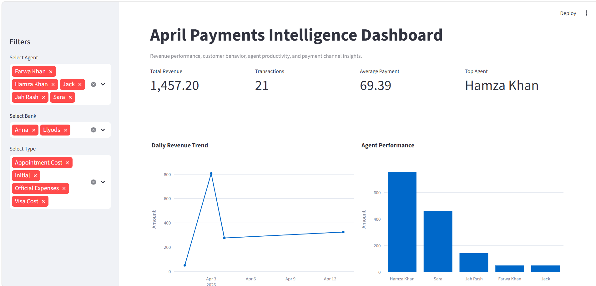
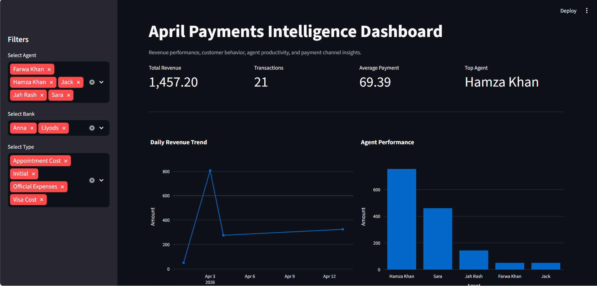

# April Payments Intelligence Dashboard

This project analyzes April payment transactions to identify revenue trends, customer behavior, agent performance, and payment channel insights.

## Objective
To convert raw payment data into actionable business insights using Python and Streamlit.

## Tools Used
- Python
- Pandas
- Plotly
- Streamlit
- Excel

## Key Features
- Revenue KPI dashboard
- Agent performance analysis
- Bank/payment channel analysis
- Payment type breakdown
- Customer revenue ranking
- Interactive filters
- Downloadable filtered dataset

## Key Insights
- Total revenue analyzed: 1,457.20
- Total transactions: 21
- Average payment: 69.39
- Hamza Khan was the top-performing agent in April 2026
- Initial payments dominated the revenue mix, showing strong new-client inflow

## Business Value
This dashboard helps identify revenue concentration, agent productivity, and payment behavior patterns for better operational and financial decision-making.

## Dashboard Preview

